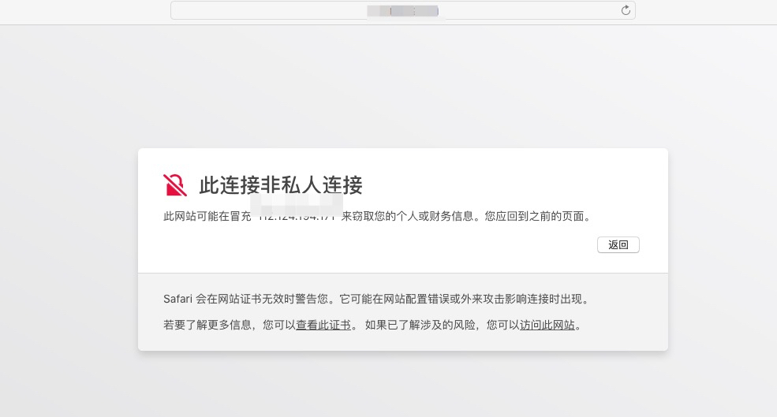
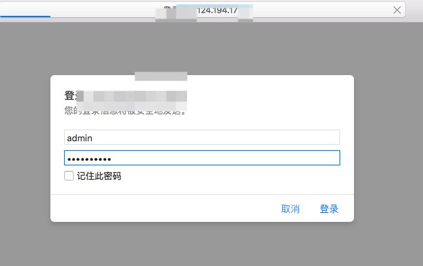
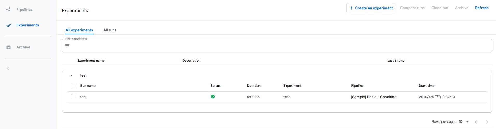

1. 在阿里云容器服务创建Kubernetes集群, 可以参考 [文档](https://github.com/AliyunContainerService/ai-starter/blob/master/docs/setup/CREATE_CLUSTER.md)

2. 下载源代码

```
git clone https://github.com/aliyunContainerService/kubeflow-aliyun
```

3. 安全配置

3.1 配置TLS证书。如果没有TLS证书，可以通过下列命令生成

```
yum install -y openssl
domain="pipelines.kubeflow.org"
openssl req -x509 -nodes -days 365 -newkey rsa:2048 -keyout kubeflow-aliyun/overlays/ack-auto-clouddisk/tls.key -out kubeflow-aliyun/overlays/ack-auto-clouddisk/tls.crt -subj "/CN=$domain/O=$domain"
```

> 如果您有TLS证书，请分别将私钥和证书保存到`kubeflow-aliyun/overlays/ack-auto-clouddisk/tls.key`和`kubeflow-aliyun/overlays/ack-auto-clouddisk/tls.crt`下

3.2 配置admin的登录密码

```
yum install -y httpd-tools
htpasswd -c kubeflow-aliyun/overlays/ack-auto-clouddisk/auth admin
New password:
Re-type new password:
Adding password for user admin

```


4. 首先利用kustomize生成部署yaml

```
cd kubeflow-aliyun/
kustomize build overlays/ack-auto-clouddisk > /tmp/ack-auto-clouddisk.yaml
```

2. 查看所在的Kubernetes集群节点所在的地域和可用区,并且根据其所在节点替换可用区，假设您的集群所在可用区为`cn-hangzhou-g`,可以执行下列命令

```
sed -i.bak 's/regionid: cn-beijing/regionid: cn-hangzhou/g' \
    /tmp/ack-auto-clouddisk.yaml

sed -i.bak 's/zoneid: cn-beijing-e/zoneid: cn-hangzhou-g/g' \
    /tmp/ack-auto-clouddisk.yaml
```
> 建议您检查一下/tmp/ack-auto-clouddisk.yaml修改是否已经设置

4. 将容器镜像地址由`gcr.io`替换为`registry.aliyuncs.com`

```
sed -i.bak 's/gcr.io/registry.aliyuncs.com/g' \
    /tmp/ack-auto-clouddisk.yaml
```

> 建议您检查一下/tmp/ack-auto-clouddisk.yaml修改是否已经设置

5. 调整使用磁盘空间大小, 比如需要调整磁盘空间为200G

```
sed -i.bak 's/storage: 100Gi/storage: 200Gi/g' \
    /tmp/ack-auto-clouddisk.yaml
```

6. 验证pipelines的yaml文件

```
kubectl create --validate=true --dry-run=true -f /tmp/ack-auto-clouddisk.yaml
```

7. 利用kubectl部署pipelines

```
kubectl create -f /tmp/ack-auto-clouddisk.yaml
```

8. 查看访问pipeline的方式

```
kubectl get ing -n kubeflow
NAME             HOSTS   ADDRESS           PORTS     AGE
ml-pipeline-ui   *       112.124.193.271   80, 443   11m
``` 

9. 访问pipeline服务 https://112.124.193.271/pipeline/

如果使用自签发证书，会提示此链接非私人链接，请点击显示详细信息， 并点击访问此网站。



请输入步骤2.2中的用户名admin和设定的密码




这时就可以使用pipelines管理和运行训练任务了。




10. 清理pipelines

```
kubectl delete -f /tmp/ack-auto-clouddisk.yaml
```

### Q&A

1. 为什么这里要使用阿里云的SSD云盘？

这是由于阿里云的SSD云盘可以设置定期的自动备份，保证pipeline中的元数据不会丢失。


